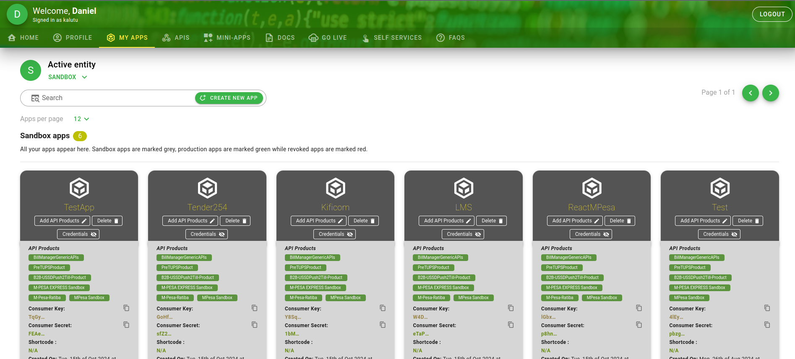
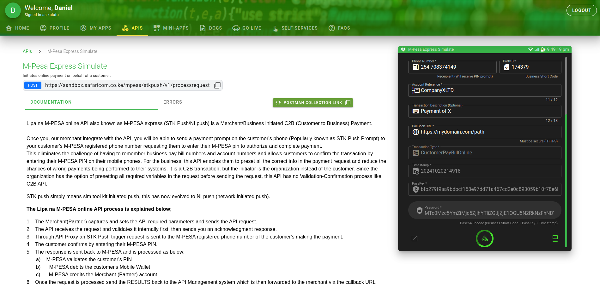
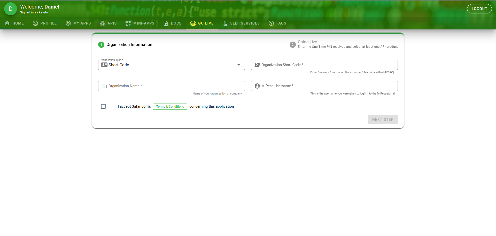

# **Getting Credentials for M-Pesa Integration**

Once you've received your **Paybill/Till number** and **admin account email**, you’re just a few steps away from going live! Let’s walk through the process.

---

## **Important Note**

This guide is for production Paybills or Tills. If you’re still in the application phase or just developing, you can start building and testing in the **sandbox environment** provided by Safaricom.

---

## **Why Use the Daraja Portal?**

To integrate M-Pesa payments into your systems, you’ll need specific credentials to authenticate requests. These include:

- **Consumer Key**
- **Consumer Secret**
- **PassKey**

These credentials can only be generated via the **Daraja portal** and are essential for both testing and live integrations.

---

## **Getting Sandbox (Test) Credentials**

The **sandbox environment** allows you to develop and test your integration before going live.

1. **Create a Daraja Portal Account:**  
   If you don’t have one, [create an account here](https://developer.safaricom.co.ke).

2. **Create a New App:**

   - Once logged in, go to the **"My Apps"** tab and click **"Create New App."**
   - Tick all checkboxes to avoid missing any required permissions.

   

3. **Retrieve Your Sandbox Credentials:**

   - After creating your app, it will appear under **"Sandbox Apps."**
   - Copy the **Consumer Key** and **Consumer Secret** from there.

   

4. **Simulate API Requests:**

   - Click the **"APIs"** tab, select your app from the dropdown, and retrieve credentials for testing.

   

   

## **Getting Live Credentials**

When you're ready to transition to production, follow these steps to obtain your live credentials:

1. **Access the Go Live Tab:**  
   Navigate to the **"Go Live"** tab on the Daraja portal and follow the prompts. You don’t need to create a new app for production. Once the setup is complete, your app will appear under the **"Live"** section within **My Apps**. From there, copy the **Consumer Key** and **Consumer Secret**.

   

2. **Receiving the PassKey:**  
   After your Paybill or Till is activated, Safaricom will send the **PassKey** to your registered email. Keep an eye on your inbox for this crucial credential, as it’s required for live API requests.

---

## **Summary of Required Credentials**

You now have the three essential credentials:

- **Consumer Key**
- **Consumer Secret**
- **PassKey**

Once these are ready, you’re all set to integrate M-Pesa with your system and start accepting payments.
